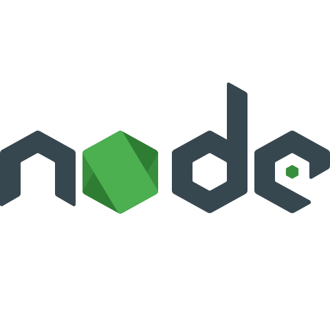

<h1 style="text-align:center"> Developing with Docker</h1>

_This app is orignally developed by [BretFisher ](https://github.com/BretFisher/udemy-docker-mastery/tree/main/dockerfile-assignment-1)_

This demo app shows a "it works" simple page
- pure index.js and css styles
- nodejs backend 

## Overview of this Demo
---

- Imagine another developer gave you the instruction below, and you'll need to interpret them into what the Dockerfile should contain.
- Once the Dockerfile builds correctly, start container locally to make sure it works on [http://localhost](http://localhost)
- Then ensure the image is named properly for your Docker Hub account with a new repository name
- Then push to Docker Hub, and go to [https://hub.docker.com](https://hub.docker.com) to verify you pushed it correctly
- Then remove local image from cache (`docker image rm <name>`)
- Then start a new container from your Hub image, and watch how it auto downloads and runs
- Test again that it works at [http://localhost](http://localhost)

## Get Started With Docker
---

- you should use the `node` official image, with the alpine 6.x branch (`node:6-alpine`)
  - (Yes this is a 2-year old image of node, but all official images are always available on Docker Hub forever, to ensure even old apps still work. It is common to still need to deploy old app versions, even years later.)
- This app listens on port 3000, but the container should listen on port 80 of the Docker host, so it will respond to [http://localhost:80](http://localhost:80) on your computer
- Then it should use the alpine package manager to install tini: `apk add --no-cache tini`.
- Then it should create directory /usr/src/app for app files with `mkdir -p /usr/src/app`, or with the Dockerfile command `WORKDIR /usr/src/app`.
- Node.js uses a "package manager", so it needs to copy in package.json file.
- Then it needs to run 'npm install' to install dependencies from that file.
- To keep it clean and small, run `npm cache clean --force` after the above, in the same RUN command.
- Then it needs to copy in all files from current directory into the image.
- Then it needs to start the container with the command `/sbin/tini -- node ./bin/www`. Be sure to use JSON array syntax for CMD. (`CMD [ "something", "something" ]`)
- In the end you should be using FROM, RUN, WORKDIR, COPY, EXPOSE, and CMD commands

